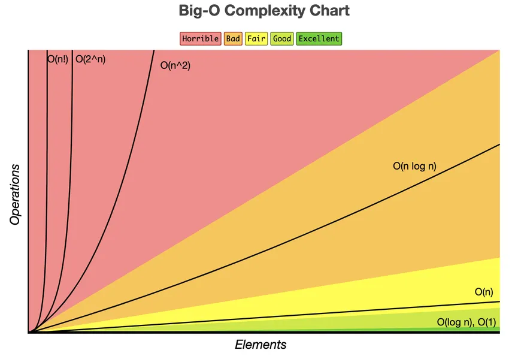

# Sumário

- [Sumário](#sumário)
- [Array (Vetor - Matrix)](#array-vetor---matrix)
  - [O que é?](#o-que-é)
  - [Análise de Big O](#análise-de-big-o)
  - [Arrays Estáticos vs. Dinâmicos](#arrays-estáticos-vs-dinâmicos)
  - [Localidade de Cache](#localidade-de-cache)
  - [Recomendação](#recomendação)

# Array (Vetor - Matrix)

Aqui, não irei te ensinar a como usar um array em liguagem 'x' ou 'y'. Mas sim seu funcionamento e teoria por trás.

## O que é?

Um array pode ser de vários tipos, como Int, Float, String, etc. E o valor é acessado passando sua posição através de índices, como por exemplo no array abaixo [10, 49, 20, 9, 16, 22].

Quando falamos de matrizes e vetores estamos simplificamente falando, de arrays! Mas com outras dimensões.Vetor é um array de uma dimensão e uma matriz é um array de mais de uma dimensão.

## Análise de Big O

Como acessamos um valor do array diretamente pelo índice, a complexidade é de O(1) para acesso.

A 'mágica' por trás do acesso instantâneo (O(1)) de um array é a forma como ele é organizado na memória do computador. Todos os seus elementos são armazenados um após o outro, em sequência, num bloco de memória contínuo.

Isso permite que o computador calcule a localização exata de qualquer elemento com uma simples fórmula matemática: endereço_do_elemento = endereço_inicial_do_array + (índice * tamanho_de_cada_elemento). Como essa conta leva o mesmo tempo não importa o índice, o acesso é O(1).

Quando falando de inserir/remover um valor do array, a complexidade é de O(n), pois você precisa deslocar odos os itens para abrir espaço ou preencher o vazio. Logo, pode ser necessáio mover o array inteiro, dependendo da disposição da memória. Mas para remover o último item do aray a complexidade é de O(1).

Assim como remover, adicionar um elemento no final de um array dinâmico também é muito eficiente. Na maioria das vezes, a operação é O(1).

Contudo, de vez em quando, o array pode ficar cheio e precisar ser redimensionado (criar um novo array maior e copiar os elementos). Essa operação específica é O(n). Como isso acontece raramente, na média, o custo de adicionar ao final se 'dilui' e é considerado O(1) Amortizado.

## Arrays Estáticos vs. Dinâmicos

Arrays Estáticos: Possuem um tamanho fixo, definido no momento da sua criação. Não é possível adicionar ou remover elementos para além da sua capacidade. Tentar fazer isso geralmente causa um erro. (Ex: int meuArray[10]; em C++).

Arrays Dinâmicos: São mais flexíveis e podem crescer ou encolher de tamanho conforme necessário. Por baixo dos panos, quando um array dinâmico fica cheio e você tenta adicionar um novo item, ele cria um novo array maior, copia todos os elementos antigos e então adiciona o novo. É por causa desse mecanismo que a complexidade de inserção pode ser O(n).

## Localidade de Cache

Por causa da memória contínua, arrays têm uma vantagem de performance muito importante no hardware moderno.

Além do acesso O(1), a estrutura contínua dos arrays na memória os torna muito 'amigáveis' para o processador. Essa característica, chamada de localidade de cache, permite que o processador leia grandes blocos do array de uma só vez para sua memória cache (uma memória ultrarrápida). Isso faz com que percorrer um array seja significativamente mais rápido na prática do que percorrer outras estruturas de dados como listas ligadas, onde os dados estão espalhados pela memória (linked-list).

## Recomendação

É muito importante você pesquisar sobre como funciona a alocação de memmória do array na linguagem que você utiliza. Quando falamos em array, o entedimento é universal, mas quando falamos da aplicação não é! A forma como um array é criado, tem valores acessados e como funciona tem sua particularidade em cada linguagem de programação.
