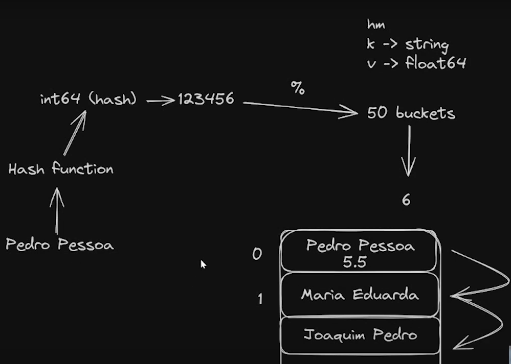

# Hash Map (Dicionário)

### Sumário
- [Hash Map (Dicionário)](#hash-map-dicionário)
    - [Sumário](#sumário)
  - [O que é um Hash Map (Dicionário)?](#o-que-é-um-hash-map-dicionário)
  - [O Problema: A Busca Lenta (O(n))](#o-problema-a-busca-lenta-on)
  - [A Solução: A Magia da Função Hash](#a-solução-a-magia-da-função-hash)
  - [Lidando com o Inevitável: Colisões](#lidando-com-o-inevitável-colisões)
  - [Análise de Performance (Big O e Análise Assintótica)](#análise-de-performance-big-o-e-análise-assintótica)
  - [Vantagens e Desvantagens](#vantagens-e-desvantagens)
  - [Exemplo de Código (TypeScript)](#exemplo-de-código-typescript)
  - [Recomendações](#recomendações)

---

## O que é um Hash Map (Dicionário)?

Um Hash Map (ou Tabela Hash) é uma estrutura de dados que implementa um **array associativo**, mais conhecido como **dicionário**. Sua principal característica é a associação de **chaves (keys)** a **valores (values)**. A grande ideia por trás de um Hash Map é poder acessar, inserir ou remover um valor usando sua chave em um tempo idealmente constante, ou seja, O(1), independente do tamanho da coleção.

## O Problema: A Busca Lenta (O(n))

Vamos supor que você quer buscar a nota de um aluno em uma lista simples. A chave seria o nome do aluno (único) e o valor seria sua nota. Uma abordagem ingênua seria usar um array de objetos.

```typescript
interface Aluno {
    chave: string; // Nome do aluno
    valor: number; // Nota
}

// Nossa lista simples que funciona como um "mapa"
const listaDeAlunos: Aluno[] = [
    { chave: "Ana", valor: 9.5 },
    { chave: "Bruno", valor: 8.0 },
    // ... milhares de outros alunos
    { chave: "Zoe", valor: 9.8 }
];

function buscarNota(alunos: Aluno[], nome: string): number {
    for (const aluno of alunos) {
        if (aluno.chave === nome) {
            return aluno.valor; 
        }
    }
    return -1;
}
```

Observe o loop `for` acima. Ele terá uma performance satisfatória se lidarmos com uma lista pequena. Agora, imagine que somos o diretor de uma faculdade com 20.000 alunos e o aluno "Zoe" é o que procuramos. Precisaríamos percorrer toda a lista para encontrá-lo.

Este sistema é **ineficiente** para essa tarefa, pois seu tempo de execução cresce linearmente com o número de alunos. Isso é uma complexidade **O(n)**.

## A Solução: A Magia da Função Hash

Para evitar a busca linear, precisamos de uma forma de "pular" diretamente para a posição onde o dado do aluno deveria estar. É aqui que entra a **função hash**.

Uma **função hash** é como um "moedor de dados" determinístico:
1.  Ela aceita uma entrada de qualquer tamanho (a nossa chave, ex: "Zoe").
2.  Executa um cálculo matemático sobre ela.
3.  Produz uma saída de tamanho fixo: um número inteiro, chamado de **hash code**.

O ponto principal é que, para a mesma chave, a função hash **sempre** produzirá o mesmo hash code.

Com esse número em mãos, podemos descobrir o índice do nosso array interno com uma simples operação de módulo (`%`):

`índice = hashCode % tamanho_do_array`



Essa operação garante que o índice calculado sempre estará dentro dos limites do nosso array. Agora, em vez de percorrer o array inteiro, nós:
1.  Pegamos a chave ("Zoe").
2.  Passamos pela função hash para obter um número.
3.  Calculamos o índice.
4.  Vamos **diretamente** para aquele índice para encontrar ou armazenar o valor.

Isso, em um mundo perfeito, é uma operação de tempo constante, **O(1)**.

## Lidando com o Inevitável: Colisões

O mundo não é perfeito. Eventualmente, duas chaves diferentes (ex: "Ana" e "Leo") podem, após passarem pela função hash, resultar no mesmo índice. Isso é chamado de **colisão**.

A estratégia mais comum para resolver colisões é o **Encadeamento Separado (Separate Chaining)**. A ideia é simples:
* Em vez de o nosso array interno armazenar valores únicos, cada posição (ou *bucket*) armazena uma pequena lista (geralmente uma linked list) de todos os pares chave-valor que colidiram naquele mesmo índice.

Quando vamos buscar um valor:
1.  Calculamos o índice com a função hash.
2.  Vamos até o *bucket* (a lista) naquele índice.
3.  Fazemos uma busca linear **apenas** nessa pequena lista para encontrar a chave correta.

Como uma boa função hash distribui as chaves de forma uniforme, essas listas internas tendem a ser muito pequenas, mantendo a performance perto de O(1).

## Análise de Performance (Big O e Análise Assintótica)

A **Análise Assintótica** estuda como a performance de um algoritmo se comporta à medida que o tamanho da entrada de dados tende ao infinito. O Big O é a notação que usamos para expressar essa complexidade.

Para um Hash Map, a análise é:

* **Acesso / Busca (Get):**
    * **Caso Médio: `O(1)`** - Com uma boa função hash e poucas colisões, encontrar a "gaveta" (bucket) e o item dentro dela é uma operação de tempo constante.
    * **Pior Caso: `O(n)`** - Em um cenário muito raro (ou com uma função hash muito ruim), todas as chaves colidem no mesmo bucket. O Hash Map se degenera em uma única lista ligada, e a busca se torna linear.

* **Inserção (Set/Put):**
    * **Caso Médio: `O(1)`** - Calcular o hash e adicionar o item no início de uma lista curta é constante.
    * **Pior Caso: `O(n)`** - No caso de colisão total, precisamos percorrer a lista para garantir que a chave não exista antes de inserir.

* **Remoção (Delete):**
    * **Caso Médio: `O(1)`** - Encontrar o item e removê-lo é, na média, constante.
    * **Pior Caso: `O(n)`** - Novamente, se tudo colidir, a busca para encontrar o item a ser removido será linear.
  


## Vantagens e Desvantagens

| Vantagens | Desvantagens |
| :--- | :--- |
| ✅ **Extremamente rápido** (média O(1)) para buscar, inserir e remover. | ❌ **Não ordenado**. Os itens não são armazenados em nenhuma ordem previsível. |
| ✅ As chaves podem ser de tipos complexos (como strings), não apenas números. | ❌ A performance no **pior caso** pode ser terrível (O(n)). |
| ✅ Muito flexível e amplamente utilizado em programação. | ❌ A escolha de uma **boa função hash** é crucial para a performance. |

## Exemplo de Código (TypeScript)

Abaixo, uma implementação simplificada de um Hash Map para ilustrar os conceitos de `buckets`, função `hash` e tratamento de `colisões`.

```typescript
interface KeyValuePair<T> {
  key: string;
  value: T;
}

class SimpleHashMap<T> {
  // O array interno que armazena os 'buckets' (gavetas)
  // Cada bucket é um array de pares chave-valor para tratar colisões
  private buckets: Array<Array<KeyValuePair<T>>>;
  private size: number;

  constructor(size: number = 50) {
    this.size = size;
    this.buckets = new Array(this.size).fill(null).map(() => []);
  }

  // Função hash simples (e não muito boa, apenas para exemplo)
  private _hash(key: string): number {
    let total = 0;
    for (let i = 0; i < key.length; i++) {
      total += key.charCodeAt(i);
    }
    // Retorna o índice usando o operador de módulo
    return total % this.size;
  }

  // Insere ou atualiza um valor
  public set(key: string, value: T): void {
    const index = this._hash(key);
    const bucket = this.buckets[index];

    // Verifica se a chave já existe no bucket e a atualiza
    for (const pair of bucket) {
      if (pair.key === key) {
        pair.value = value;
        return;
      }
    }

    // Se não existe, adiciona o novo par ao bucket (tratando a colisão)
    bucket.push({ key, value });
  }

  // Busca um valor pela chave
  public get(key: string): T | undefined {
    const index = this._hash(key);
    const bucket = this.buckets[index];

    // Procura pela chave correta dentro do bucket
    for (const pair of bucket) {
      if (pair.key === key) {
        return pair.value;
      }
    }

    // Retorna undefined se a chave não for encontrada
    return undefined;
  }
}

// --- Testando a implementação ---
const studentGrades = new SimpleHashMap<number>();

studentGrades.set("Ana", 9.5);
studentGrades.set("Bruno", 8.0);
studentGrades.set("Zoe", 9.8);
studentGrades.set("Leo", 7.5); // "Leo" e "Ana" podem colidir no nosso hash simples!

console.log(`Nota da Ana: ${studentGrades.get("Ana")}`);
console.log(`Nota do Leo: ${studentGrades.get("Leo")}`);
console.log(`Nota do Pedro: ${studentGrades.get("Pedro")}`); // undefined

```

## Recomendações

Como sempre digo, cada linguagem de programação tem suas particularidades deve-se como obrigação do profissional buscar entender a aplicação ou funcionamento dessa estrutura na linguagem que utiliza na documentação ou código da linguagem.