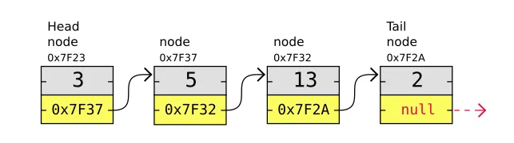
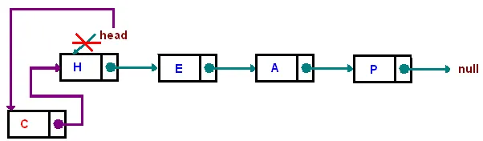

# Linked List (Lista Ligada)

### Sumário
- [Linked List (Lista Ligada)](#linked-list-lista-ligada)
    - [Sumário](#sumário)
  - [O que é uma Linked List?](#o-que-é-uma-linked-list)
  - [O Problema: A Ineficiência da Inserção/Remoção em Arrays](#o-problema-a-ineficiência-da-inserçãoremoção-em-arrays)
  - [A Solução: A Flexibilidade dos Ponteiros](#a-solução-a-flexibilidade-dos-ponteiros)
  - [Análise de Performance (Big O e Análise Assintótica)](#análise-de-performance-big-o-e-análise-assintótica)
  - [Vantagens e Desvantagens](#vantagens-e-desvantagens)
  - [Exemplo de Código (TypeScript)](#exemplo-de-código-typescript)

---

## O que é uma Linked List?

Uma **Lista Ligada** é uma estrutura de dados linear, assim como um array, mas com uma diferença fundamental na forma como armazena seus elementos na memória. Enquanto um array guarda seus dados em um bloco de memória contíguo (um ao lado do outro), uma Lista Ligada os espalha pela memória.

A "mágica" que conecta esses elementos espalhados é a ideia de **Nós (Nodes)** e **Ponteiros (Pointers)**.

Pense em uma **caça ao tesouro**:
1.  Você começa em um ponto de partida (`head`).
2.  A primeira pista (`Node`) contém o tesouro daquela etapa (`valor`) e, mais importante, a localização da próxima pista (`ponteiro next`).
3.  Você segue essa corrente de pistas até chegar à última, que não aponta para lugar nenhum (`next: null`).

Essa corrente de nós é a Lista Ligada. Cada **Nó** é um objeto que contém duas informações:
* **O dado** (valor) que ele armazena.
* **Um ponteiro** (referência) para o próximo nó na sequência.

O ponto de entrada para a lista é sempre o primeiro nó, chamado de **Head (Cabeça)**.



## O Problema: A Ineficiência da Inserção/Remoção em Arrays

Vimos que arrays são fantásticos para acesso rápido (O(1)). No entanto, eles são muito ineficientes quando precisamos adicionar ou remover elementos no **início** ou no **meio** da coleção.

Imagine uma playlist de músicas em um array. Se você decidir adicionar uma nova música no início da playlist, todos os outros milhões de músicas precisam ser "empurrados" uma posição para a frente na memória. Isso é uma operação extremamente custosa, com complexidade **O(n)**, pois o custo cresce com o tamanho da lista.

```typescript
const playlist = ["Música B", "Música C", "Música D"];

// Para adicionar "Música A" no início, precisamos fazer isso:
// 1. Criar um novo array maior.
// 2. Mover "Música D" para a nova posição.
// 3. Mover "Música C" para a nova posição.
// 4. Mover "Música B" para a nova posição.
// 5. Adicionar "Música A".
// Resultado: ["Música A", "Música B", "Música C", "Música D"]
```
Essa operação de deslocamento é o grande gargalo de performance dos arrays para esse caso de uso.

## A Solução: A Flexibilidade dos Ponteiros

Uma Linked List resolve esse problema de forma brilhante. Para inserir um novo elemento, não precisamos mover nenhum dado existente. Apenas "rearranjamos" os ponteiros.

**Para inserir "Música A" no início da lista `[B] -> [C] -> [D]`:**
1.  Criamos um novo nó para a "Música A".
2.  Fazemos o ponteiro `next` do nó "A" apontar para o antigo início da lista (o nó "B").
3.  Atualizamos o `head` da lista para que ele agora aponte para o nosso novo nó "A".

Pronto! A operação é feita em tempo constante, **O(1)**, não importa se a lista tem 3 ou 3 milhões de músicas. A mesma lógica se aplica para a remoção no início.



## Análise de Performance (Big O e Análise Assintótica)

A **Análise Assintótica** de uma Lista Ligada revela um perfil de performance quase oposto ao de um array.

* **Acesso / Busca (Get/Search): `O(n)`**
    * Este é o principal ponto fraco. Para encontrar o 100º elemento, você **precisa** começar pelo `head` e passar pelos 99 nós anteriores. Não há como pular diretamente para um índice. A busca é sempre linear.

* **Inserção / Remoção no Início (Prepend): `O(1)`**
    * Extremamente rápido. Envolve apenas a atualização de um ou dois ponteiros, como vimos no exemplo.

* **Inserção / Remoção no Final (Append): `O(1)` ou `O(n)`**
    * Se a lista mantiver um ponteiro para o último nó (`tail`), a operação é **O(1)**.
    * Se não houver um ponteiro `tail`, a operação se torna **O(n)**, pois é preciso percorrer toda a lista para encontrar o último nó antes de adicionar o novo.

* **Inserção / Remoção no Meio: `O(n)`**
    * A operação de "religar" os ponteiros em si é O(1), mas **encontrar o local** para fazer a inserção/remoção exige uma travessia linear a partir do início, resultando em uma complexidade total de O(n).

## Vantagens e Desvantagens

| Vantagens | Desvantagens |
| :--- | :--- |
| ✅ **Inserções e remoções muito rápidas** no início (e no fim, se houver `tail`). | ❌ **Acesso e busca lentos (O(n))**. Não há acesso aleatório por índice. |
| ✅ **Tamanho dinâmico**. Cresce e encolhe de forma eficiente sem precisar realocar toda a estrutura. | ❌ **Localidade de cache ruim**. Os nós estão espalhados na memória, o que é menos eficiente para o processador do que a memória contígua de um array. |
| ✅ Flexibilidade na manipulação de sequências de dados. | ❌ **Usa mais memória** do que um array, pois cada nó precisa armazenar o valor e um ponteiro adicional. |

## Exemplo de Código (TypeScript)

Abaixo, uma implementação de uma Lista Ligada Simples (Singly Linked List) para ilustrar os conceitos.

```typescript

class ListNode<T> {
  public next: ListNode<T> | null = null;

  constructor(public value: T) {}
}

class LinkedList<T> {
  private head: ListNode<T> | null = null;
  private tail: ListNode<T> | null = null;
  private length: number = 0;

  // Adiciona um elemento no final da lista (Append) - O(1)
  public append(value: T): void {
    const newNode = new ListNode(value);
    if (!this.head || !this.tail) {
      this.head = newNode;
      this.tail = newNode;
    } else {
      this.tail.next = newNode;
      this.tail = newNode;
    }
    this.length++;
  }

  // Adiciona um elemento no início da lista (Prepend) - O(1)
  public prepend(value: T): void {
    const newNode = new ListNode(value);
    if (!this.head) {
      this.head = newNode;
      this.tail = newNode;
    } else {
      newNode.next = this.head;
      this.head = newNode;
    }
    this.length++;
  }

  // Remove um elemento da lista - O(n)
  public delete(value: T): ListNode<T> | null {
    if (!this.head) {
      return null;
    }

    let deletedNode: ListNode<T> | null = null;

    // Se o nó a ser deletado for o head
    while (this.head && this.head.value === value) {
      deletedNode = this.head;
      this.head = this.head.next;
      this.length--;
    }

    let currentNode = this.head;
    if (currentNode !== null) {
      // Percorre o resto da lista
      while (currentNode.next) {
        if (currentNode.next.value === value) {
          deletedNode = currentNode.next;
          currentNode.next = currentNode.next.next;
          this.length--;
        } else {
          currentNode = currentNode.next;
        }
      }
    }
    
    // Atualiza o tail se o último elemento foi removido
    if(this.tail?.value === value) {
        this.tail = currentNode;
    }

    return deletedNode;
  }
  
  // Imprime a lista para visualização
  public print(): void {
    const values: T[] = [];
    let currentNode = this.head;
    while (currentNode) {
      values.push(currentNode.value);
      currentNode = currentNode.next;
    }
    console.log(values.join(' -> '));
  }
}

const playlist = new LinkedList<string>();
playlist.append("Música C");
playlist.append("Música D");
playlist.prepend("Música B");
playlist.prepend("Música A");

console.log("Playlist inicial:");
playlist.print(); // Saída: Música A -> Música B -> Música C -> Música D

playlist.delete("Música C");
console.log("\nPlaylist após deletar 'Música C':");
playlist.print(); // Saída: Música A -> Música B -> Música D
```

